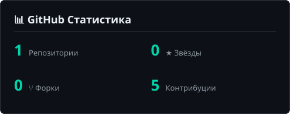
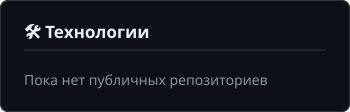
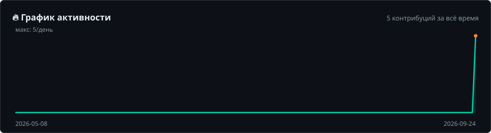

# 👋 Привет, я visualend!

### Разработчик | Обучаюсь | Создаю

---

## 🚀 О себе

🔹 Начинающий разработчик, который учится и растёт в мире кода  
🔹 Люблю создавать полезные проекты и делиться ими с сообществом  
🔹 Всегда открыт к новым идеям и коллаборациям

---

## 🛠️ Технологии

<!-- Стилизуй под себя: добавь/убери нужные языки и инструменты -->

---

## 📊 GitHub Статистика

  
  

---

## 🔥 График активности

  

---

## 📈 Гитхаб-стрим

  

---

## 🤝 Свяжитесь со мной

---

### ⭐ Спасибо, что заглянул!

*Если тебе понравились мои проекты — поставь звёздочку! ✨*

